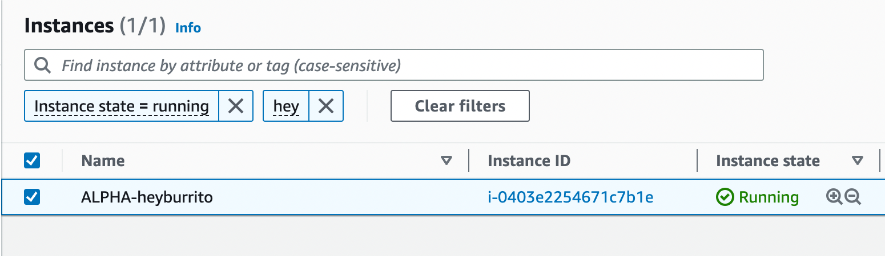
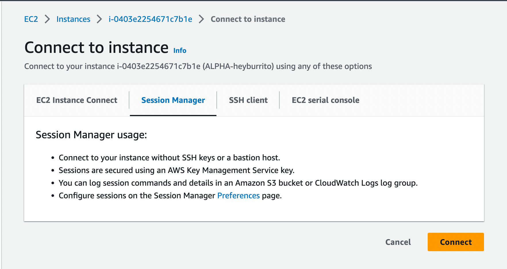
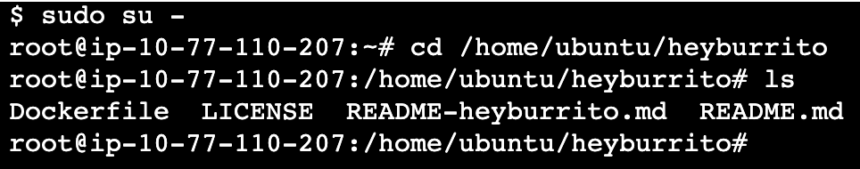
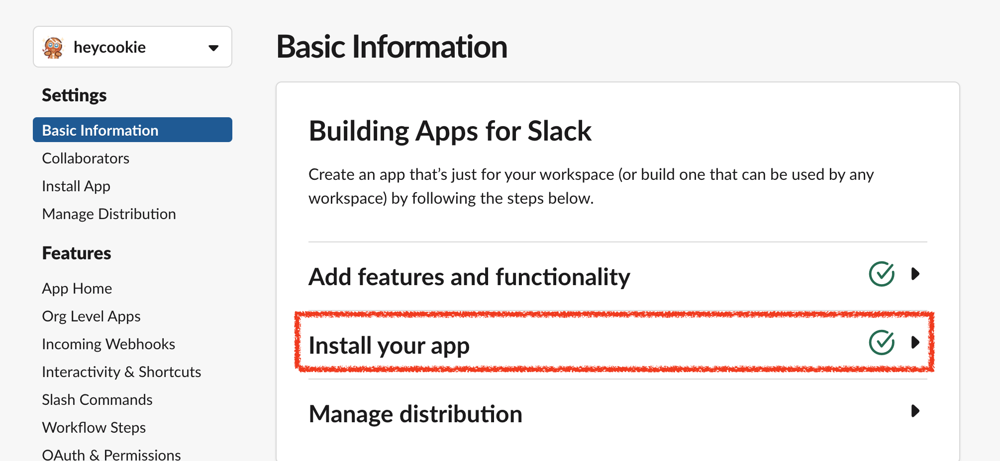
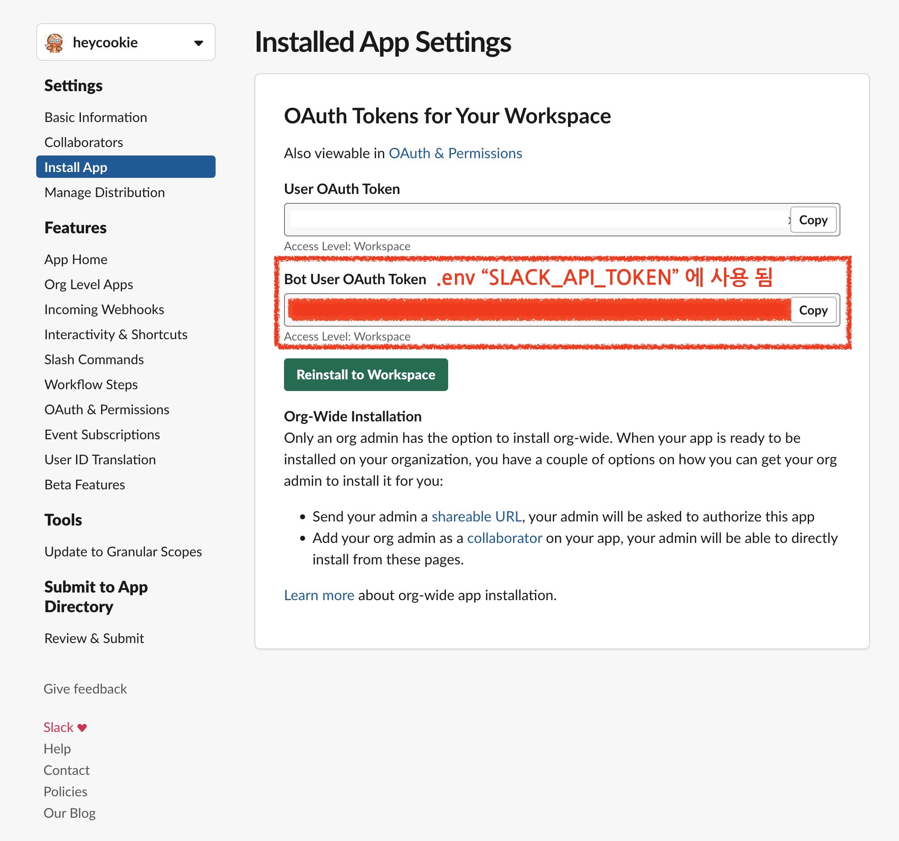

# HeyCookie

이 레포지토리는 [heyburrito](https://github.com/chralp/heyburrito)를 커스텀한 것입니다.

## Getting Started

1. heyburrito ec2 서버에 접속한다(서울 리전 > EC2 > Connect to Instance(Session Manager))

2. 터미널에서 `sudo su -` 명령으로 root 계정으로 전환한다

3. `cd /home/ubuntu/heyburrito` 명령으로 애플리케이션 폴더로 이동한다

4. `docker-compose up -d` 명령으로 컨테이너를 띄워서 앱을 실행시킨다

## Configuration
https://api.slack.com/apps/A03UJAU5QK0 에서 heycookie 슬랙 앱 관련 설정을 변경할 수 있습니다.

## References

- Slack 앱은 classic 앱으로 만들어야 합니다.
- 해당 앱에 legacy bot user를 추가해주어야 합니다.
- https://github.com/slackapi/node-slack-sdk/issues/921

## 앱이 비활성화 되었다면?
1. https://api.slack.com/apps/A03UJAU5QK0 여기에 접속합니다.
2. `Install your app`을 클릭합니다. 이렇게 하면 다시 슬랙 워크스페이스에 앱이 연결됩니다.
   
3. ec2에 접속해서 app token을 변경합니다. 앱이 재활성화 되면 토큰값이 수정됩니다.
   
4. .env에서 값을 수정하면 `docker-compose up -d`  명령어로 컨테이너를 재시작합니다.
5. 슬랙 [#따끈따끈 베이커리](https://grepp.slack.com/archives/C0410JZTA4T)에 접속하고, 앱을 추가합니다. 
   * 메세지창에서 @heycookie 멘션하여 초대

